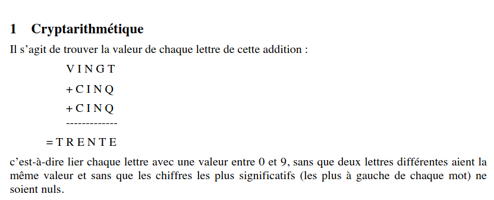
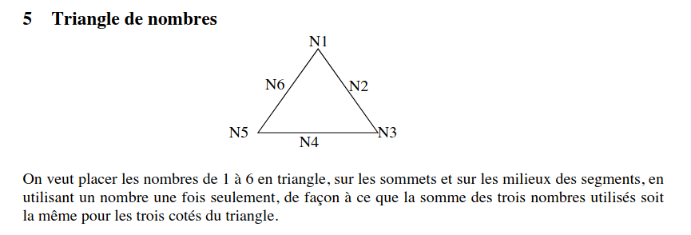
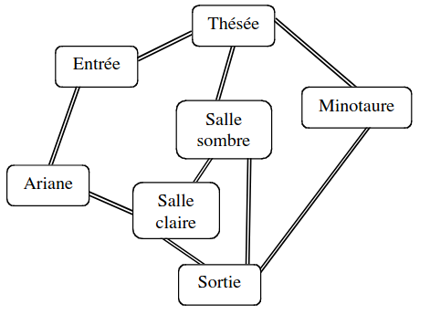

# Prolog
Un repo qui contient la résolution de quelques problèmes logiques en utilisant le langage de programmation prolog et de la reccursion.  
Les sujets ont été faits par moi , quelques fois avec l'aide de mon prefesseur. 

### Interrogation du moteur pl  
Vous trouverez dans le fichier `src/interro_base.pl` un fichier dans lequel il y'a une petite base de données que vous pourrez interroger.  
Il y'a aussi un petit exo rigolo sur qui vole qui ;)
### Exercices de satisfactions de contraintes (CSP)
Ce type d'exercices pose des problèmes qui ont des contraintes.  
Par exemple dans le fichier `src/CSP.pl`, vous trouverez l'enoncé et le corrigé d'un problème qu'une entreprise rencontre.  
Il y'a des employés qui doivent aller en vacances et il y'a des contraintes sur qui ne doit pas partir juste après un autre, qui ne peut pas partir en premier ou dernier etc.  

## Cript_arithmetique
Vous trouverez l'énoncé et le corrigé dans le fichier `.pl`correspondant.  
Une petite illustration du problème:  
  
Testez donc et voyez si les valeurs qui ont été trouvées marchent en faisant le calcul.  
Vous trouverez un exemple d'exécution avce la reponse du moteur pl

## Triangle de nombres
Vous trouverez également l'énoncé et le corrigé dans le fichier `src/criptarithmetique.pl`.  
Il a la même logique que le problème d'au desssus.  
Petite illustration:  
  
Là aussi, je vous invite à regarder l'exécution et la reponse du moteur pl puis d'essayer de voir si les valeurs fournies marchent pour resoudre le problème

## Problème du zèbre 
C'est un problème que j'ai trouvé rigolo.  
On dispose d'une grande base d'informations, et on doit déduire qui est le propriétaire du zèbre et qui boit du vin.  
Je vous laisse regarder le fichier `.pl` correspondant.

## Labyrinte  
Un petit problème de recherche dans un graphe d'états.  
On à un labyrinte en photo , on le modelise et on essaie de partir d'un endroit à un autre.  
Vous trouverez le code dans le fichier `pl` correspondant.  
N'hésitez pas à imaginer votre labyrinte et varier les paramètres pour avoir la solution à votre labyrinte.  
  

  

## Installation de Swi-Prolog sur linux  
Pour installer prolog sous linux et pouvoir exécuter le code et voir la résolution , il faut taper:  
```bash
sudo apt update
sudo apt install swi-prolog
```
Pour verifier qu'il s'est bien installé, tapez sur votre terminal la commande :
``` bash
swipl
```  
Si tout s'est bien passé, vous aurez l'interface de swi-prolog avec un `?-` qui s'affiche. 

## Compilation et Execution  
### Compliation
Pour compiler, il faut charger le fichier dans la mémoire prolog.  
Pour faire ça, placez vous dans le répertoire qui contient votre fichier avant d'ouvrir l'interface prolog.  
Ensuite, ouvrez l'interface, et chargez le fichier en tappant `[nom_du_fichier].` sans son extention.  
Par exemple pour le fichier `CSP.pl`, il vous faudra taper : `[CSP].`  
Le point "." à la fin est très important. C'est la syntaxe de prolog.  
Si tout se passe bien, l'interface vous affichera `true.`. Cela signifie que le fichier est chargé en mémoire et prêt à être exécuté.

### Execution
Cette partie consiste à appeler les fonctions pour voir ce qu'elles donnent comme resulat.  
Dans chaque fichier, vous trouverez des explications et un exemple de comment vous pouvez appeler la fonction pour voir son exécution.   
Par exemple dans le fichier `CSP.pl` il y'a des explications sur comment exécuter et ce qu'il vous repondra.


### Amusez vous et trouver d'autres problèmes que vous pourriez modéliser de la même manière et essayez de les resoudre. 

#### Je vous propose celui ci : 

    5 personnes (Marie, Lucas, Abdel, Mamadou, Evelyn) habitent dans un immeuble de 5 étages (un appartement par étage).  

    Marie n'habite pas au 4e, et Lucas pas au RDC.  
    Abdel n'habite ni au 4e ni au RDC et n'habite pas un étage adjacent à celui d'Evelyn ni celui de Lucas.  
    Mamadou habite un étage plus haut que Abdel.
    Qui habite à quel étage ? 


